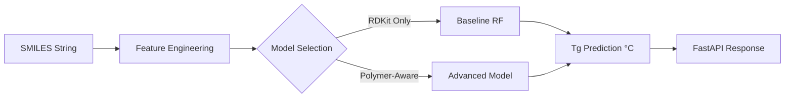

## Polymer Tg Predictor

Machine learning system for predicting the glass transition temperature (Tg) of
polymers from SMILES representations using RDKit descriptors 
and polymer-aware features.

This project implements an end-to-end ML pipeline, including:
- feature engineering
- model training
- model serialization
- inference API
- minimal frontend interface

The goal is to demonstrate polymer informatics + ML system design.


## Problem Statement

Glass transition temperature (Tg) is a critical property of polymers that 
determines their mechanical and thermal behavior.

However, experimental measurement is expensive and slow, and polymer design 
requires screening large chemical spaces

This project builds a machine learning model that predicts Tg directly 
from polymer repeat-unit SMILES.

## Why This Project

This project combines:

polymer materials science knowledge

cheminformatics

machine learning

backend ML system design

The goal is to demonstrate how domain knowledge + ML engineering 
can be integrated to build practical scientific prediction tools.

## System Overview

Architecture:

## System Architecture



The model receives a polymer SMILES string and returns the predicted Tg.

Example API response:
{
 "smiles": "CCO",
 "predicted_tg": 81.2,
 "model_version": "v1.0.0"
}


## Dataset

The dataset consists of polymer SMILES representations paired with 
experimentally measured glass transition temperatures (Tg) **in Celsius**.  

Before modeling, the dataset is cleaned to remove invalid SMILES entries, 
missing Tg values, and duplicate records.

Source: 
https://www.kaggle.com/datasets/linyeping/extra-dataset-with-smilestgpidpolimers-class/data


## Exploratory Data Analysis (EDA)

This project began with an exploratory data analysis phase to understand data 
quality, descriptor characteristics, and to guide feature engineering decisions.
 (notebooks 01-04)

During EDA, RDKit molecular descriptors were generated from validated SMILES 
strings. Descriptor quality was assessed by examining missing-value ratios, 
variance, and inter-feature correlations across the full dataset.

Key exploratory findings include:

- A subset of descriptors exhibited extremely high missing-value ratios and 
were deemed uninformative.
- Median imputation was sufficient to stabilize descriptor 
distributions during prototyping.
- Many descriptors showed near-zero variance or high pairwise correlation, 
indicating redundancy.
- Reasonable thresholds were identified for feature reduction, including 
missing-value ratio, variance cutoff, and correlation cutoff.

All statistics in the EDA phase were computed on the full dataset and were 
used only to inform design decisions.
They were not used for final model training or evaluation.

A separate baseline feature pipeline was later constructed, where the same 
rules were applied using statistics fitted exclusively on the training set to
prevent data leakage.

## API

The prediction service is implemented using FastAPI.

- Endpoint:

POST /predict

- Request:

{
 "smiles": "CCO"
}

- Response:

{
 "smiles": "CCO",
 "predicted_tg": 78.1,
 "model_version": "1.0.0"
}

- Invalid SMILES example:

{
 "details": "Invalid SMILES string"
}

##　Running the Project

- Install dependencies

Recommended environment: Python 3.10

```
conda create -n polymer-ml python=3.10
conda activate polymer-ml
```

Install packages:
```
pip install -r requirements.txt
```
Key dependencies:

RDKit
scikit-learn
pandas
FastAPI
uvicorn

## Model Performance Comparison

| Model | Features | RMSE (°C) | R² |
|------|------|------|------|
| Baseline RF | RDKit descriptors | 39.92 | 0.88 |
| Gradient Boosting | RDKit descriptors | 43.70 | 0.85 |
| RF + Polymer features | RDKit descriptors + polymer-aware | 40.4 | 0.87 |
| Gradient Boosting + Polymer Features | RDKit descriptors + polymer-aware | 42.88 | 0.86 |

## Result Analysis & Discussion

In our experiments, the **Baseline RF** (using only RDKit descriptors) slightly outperformed the model with additional **Polymer-aware features**. This counter-intuitive result provides several insights:

1. **Feature Redundancy**: Many RDKit molecular descriptors already capture structural information (like branching, molecular weight, and functional groups) that overlaps with custom polymer features.
2. **Curse of Dimensionality**: Adding more features to a relatively small dataset can introduce noise, leading the Random Forest model to overfit on less significant variables.
3. **Information Density**: The RDKit descriptors were filtered based on variance and correlation during EDA, resulting in a more "information-dense" feature set compared to the expanded set.

